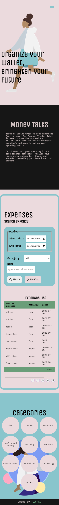

# Expenses list - a table compliant with Web Accessibility requirements

One of the recruitment tasks was to create a table with a simple form that allows filtering data. While working on this task, I learned how to write code that complies with Web Accessibility requirements [for tables](https://dequeuniversity.com/checklists/web/tables), [lists](https://dequeuniversity.com/checklists/web/lists) and [forms](https://dequeuniversity.com/checklists/web/form-input-labels-instructions).

This is not difficult, and the topic of web acessibility is one that is very important when designing and coding applications. I would like to learn more and use my knowledge of web accesiability in other, more complex projects :)

## Table of contents

- [Overview](#overview)
  - [The challenge](#the-challenge)
  - [Screenshot](#screenshot)
- [My process](#my-process)
  - [Built with](#built-with)
  - [Continued development](#continued-development)

## Overview

Visit: https://asd-expeneses-list.netlify.app/ :) 

### The challenge

Users should be able to:
- filter data by category, name and date

### Screenshot

Mobile:

## My process

### Built with

- Semantic HTML5 markup
- SASS 
- Mobile-first workflow
- JavaScript
- The most important: 
[Web Accesability practices](https://dequeuniversity.com/checklists/web).

### Continued development

- Time will tell :) 

